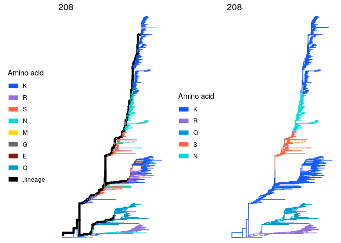
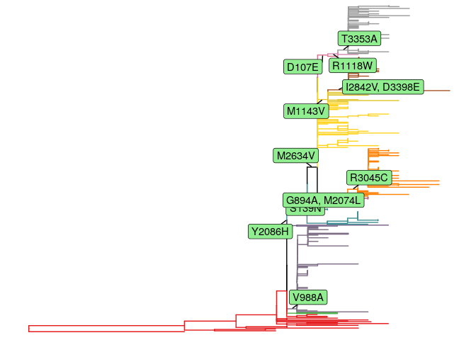
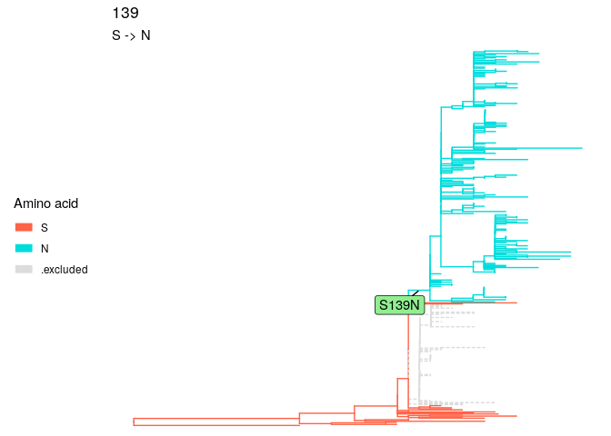
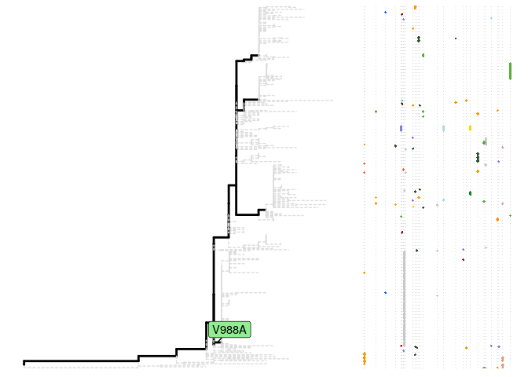
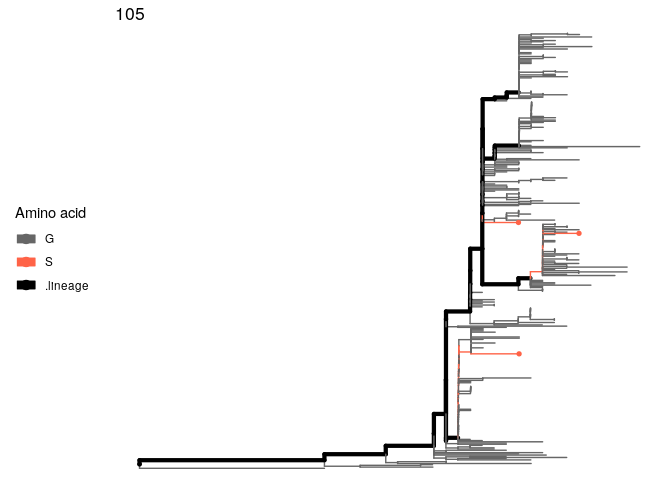

sitePath: phylogeny-based sequence clustering using site polymorphism
================

The below demonstrates the result of phylogeny-based sequence clustering
for a H3N2 virus dataset (included in the package)

``` r
library(sitePath)

data(h3n2_align) # load the H3N2 sequences
data(h3n2_tree) # load the corresponding phylogenetic tree

options(list("cl.cores" = 10)) # Use 10 cores for multiprocessing

paths <- lineagePath(h3n2_tree, alignment = h3n2_align, Nmin = 0.05)
```

    ## The "tree" object is not bifurcated and resolved by "multi2di" function.

    ## Using 10 cores..
    ## Multiprocessing ended.

``` r
minEntropy <- sitesMinEntropy(paths)
```

    ## Using 10 cores..
    ## Multiprocessing ended.

``` r
p1 <- plotSingleSite(paths, site = 208) # The site polymorphism of site 208 on the tree
p2 <- plotSingleSite(minEntropy, site = 208) # The result of clustering using site 208
gridExtra::grid.arrange(p1, p2, ncol = 2)
```

<!-- -->

``` r
grp1 <- extractTips(paths, 208) # Grouping result using site polymorphism only
grp2 <- extractTips(minEntropy, 208) # Phylogeny-based clustering result
```

# Installation

[R programming language](https://cran.r-project.org/) \>= 4.1.0 is
required to use `sitePath`.

The stable release is available on
[Bioconductor](https://bioconductor.org/packages/sitePath/).

``` r
if (!requireNamespace("BiocManager", quietly = TRUE))
    install.packages("BiocManager")

BiocManager::install("sitePath")
```

The installation from [GitHub](https://github.com/wuaipinglab/sitePath/)
is in experimental stage but gives the newest feature:

``` r
if (!requireNamespace("remotes", quietly = TRUE))
    install.packages("remotes")

remotes::install_github("wuaipinglab/sitePath")
```

# QuickStart

The following is a quick tutorial on how to use `sitePath` to find
fixation and parallel sites including how to import data, run analysis
and visualization of the results.

## 1. Data preparation

You need a *tree* and a *MSA* (multiple sequence alignment) file and the
sequence names have to be matched!

``` r
library(sitePath) # Load the sitePath package

# The path to your tree and MSA files
tree_file <- system.file("extdata", "ZIKV.newick", package = "sitePath")
alignment_file <- system.file("extdata", "ZIKV.fasta", package = "sitePath")


tree <- read.tree(tree_file) # Read the tree file into R
align <- read.alignment(alignment_file, format = "fasta") # Read the MSA file into R
```

## 2. Run analysis

`Nmin` and `minSNP` are the respective parameters for finding fixation
and parallel sites (18 and 1 are used as an example for this dataset).
The default values will be used if you don’t specify them.

``` r
options(list("cl.cores" = 1)) # Set this bigger than 1 to use multiprocessing

paraFix <- paraFixSites(tree, alignment = align, Nmin = 18, minSNP = 1) # Run analysis to find fixation and parallel sites
paraFix
```

    ## This is a 'paraFixSites' object
    ## 
    ## fixation sites:
    ## 139, 894, 2074, 2086, 2634, 3045, 988, 1143, 2842, 3398, 107, 1118, 3353
    ## 
    ## parallel sites:
    ## 105, 2292, 1264, 918, 1226, 1717, 988, 2611, 2787, 2749, 3328, 3162, 1857, 2445, 358, 1404, 3046, 791, 1180, 1016, 1171, 1327, 3076, 106, 2357, 916, 1303, 969, 573, 2909, 2122, 940
    ## 
    ## paraFix sites:
    ## 988

## 3. Fixation sites

Use `allSitesName` and set `type` as “fixation” to retrieve fixation
sites name

``` r
allSitesName(paraFix, type = "fixation")
```

    ##  [1] "139"  "894"  "2074" "2086" "2634" "3045" "988"  "1143" "2842" "3398"
    ## [11] "107"  "1118" "3353"

Use `plotFixationSites` to view fixation sites

``` r
plotFixationSites(paraFix) # View all fixation sites on the tree
```

<!-- -->

``` r
plotFixationSites(paraFix, site = 139) # View a single site
```

<!-- -->

## 4. Parallel sites

Use `allSitesName` and set `type` as “parallel” to retrieve parallel
sites name

``` r
allSitesName(paraFix, type = "parallel")
```

    ##  [1] "105"  "2292" "1264" "918"  "1226" "1717" "988"  "2611" "2787" "2749"
    ## [11] "3328" "3162" "1857" "2445" "358"  "1404" "3046" "791"  "1180" "1016"
    ## [21] "1171" "1327" "3076" "106"  "2357" "916"  "1303" "969"  "573"  "2909"
    ## [31] "2122" "940"

Use `plotParallelSites` to view parallel sites

``` r
plotParallelSites(paraFix) # View all parallel sites on the tree
```

<!-- -->

``` r
plotParallelSites(paraFix, site = 105) # View a single site
```

<!-- -->

# Read more

The above uses wrapper functions but the analysis can be dissembled into
step functions (so you can view the result of each step and modify
parameters). Click
[here](https://bioconductor.org/packages/release/bioc/vignettes/sitePath/inst/doc/sitePath.html)
for a more detailed tutorial.

# Getting help

Post on Bioconductor [support site](https://support.bioconductor.org/)
if having trouble using `sitePath`. Or open an
[issue](https://github.com/wuaipinglab/sitePath/issues/new?assignees=&labels=&template=bug_report.md&title=)
if a bug is found.
