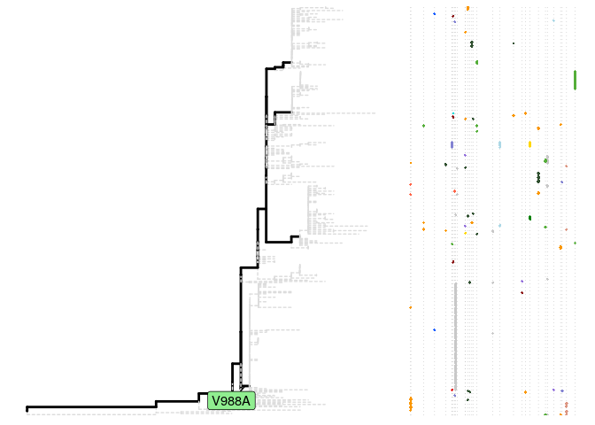

# sitePath: Phylogenetic pathway–dependent recognition of fixed substitutions and parallel mutations

## Getting help

Post on Bioconductor [support site](https://support.bioconductor.org/)
if having trouble using `sitePath`. Or open an
[issue](https://github.com/wuaipinglab/sitePath/issues/new?assignees=&labels=&template=bug_report.md&title=)
if a bug is found.

## Installation

[R programming language](https://cran.r-project.org/) \>= 4.1.0 is
required to use `sitePath`.

The stable release is available on
[Bioconductor](https://bioconductor.org/packages/sitePath/).

``` r
if (!requireNamespace("BiocManager", quietly = TRUE))
    install.packages("BiocManager")

BiocManager::install("sitePath")
```

The installation from [GitHub](https://github.com/wuaipinglab/sitePath/)
is in experimental stage but gives the newest feature:

``` r
if (!requireNamespace("remotes", quietly = TRUE))
    install.packages("remotes")

remotes::install_github("wuaipinglab/sitePath")
```

## Data preparation

You need a *tree* and a *MSA* (multiple sequence alignment) file and the
sequence names have to be matched!

``` r
library(sitePath) # Load the sitePath package

# The path to your tree and MSA files
tree_file <- system.file("extdata", "ZIKV.newick", package = "sitePath")
alignment_file <- system.file("extdata", "ZIKV.fasta", package = "sitePath")


tree <- read.tree(tree_file) # Read the tree file into R
align <- read.alignment(alignment_file, format = "fasta") # Read the MSA file into R
```

## Run analysis

Use `paraFixSites` function to find fixation and parallel sites.

``` r
options(list("cl.cores" = 1)) # Set this bigger than 1 to use multiprocessing

paraFix <- paraFixSites(tree, alignment = align) # Run analysis to find fixation and parallel sites
paraFix
```

    ## This is a 'paraFixSites' object
    ## 
    ## fixationsites:
    ## 106, 109, 139, 709, 1118, 2086, 3144, 3190, 80, 2611, 2634, 894, 1542, 2074, 3045, 784, 988, 196, 1143, 2842, 3328, 3398, 107, 3353
    ## 
    ## parallelsites:
    ## 1118
    ## 
    ## paraFixsites:
    ## 1118

## Fixation sites

Use `allSitesName` and set `type` as “fixation” to retrieve fixation
sites name

``` r
allSitesName(paraFix, type = "fixation")
```

    ##  [1] "106"  "109"  "139"  "709"  "1118" "2086" "3144" "3190" "80"   "2611"
    ## [11] "2634" "894"  "1542" "2074" "3045" "784"  "988"  "196"  "1143" "2842"
    ## [21] "3328" "3398" "107"  "3353"

Use `plotFixationSites` to view fixation sites

``` r
plotFixationSites(paraFix) # View all fixation sites on the tree
```

<!-- -->

``` r
plotFixationSites(paraFix, site = 139) # View a single site
```

<!-- -->

## Parallel sites

Use `allSitesName` and set `type` as “parallel” to retrieve parallel
sites name

``` r
allSitesName(paraFix, type = "parallel")
```

    ## [1] "1118"

Use `plotParallelSites` to view parallel sites

``` r
plotParallelSites(paraFix) # View all parallel sites on the tree
```

<!-- -->

``` r
plotParallelSites(paraFix, site = 1118) # View a single site
```

<!-- -->
